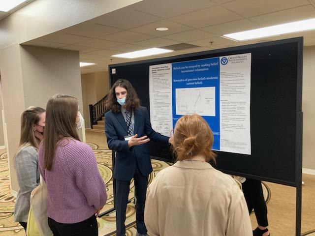
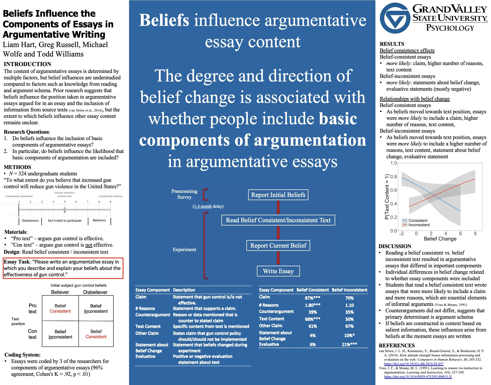
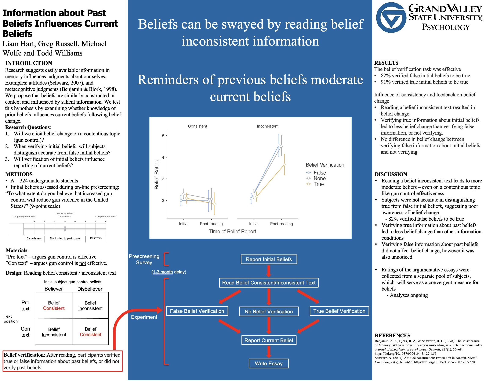
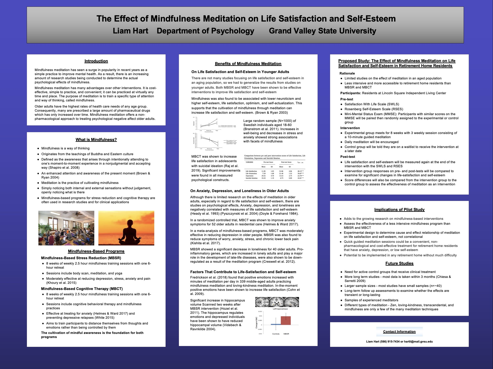

## Beliefs Influence Argumentative Writing

#### May 8, 2023 / 32nd Annual Meeting of the Society for Text and Discourse

Hart, L., Russel, G., Wolfe, M., & Williams, T. (2023) Beliefs Influence Argumentative Writing. Poster presented at the Midwest Cognitive Science Conference, Grand Rapids, MI.

#### Abstract

Individual differences in argument schema are a primary determinant of which basic components of argumentation are included in written arguments, but there has been little investigation into other factors at play. The present experiment investigated the influence of beliefs on the generation of written argument. Believers and disbelievers in gun control effectiveness read a one-sided text that was either consistent or inconsistent with their beliefs, then wrote a 250-word argumentative essay explaining their beliefs. Essays were coded for the presence or absence of a claim, number of reasons supporting the claim, and the presence of a and the presence or absence of a claim, counterargument, text content, policy claim, statement about belief change, and evaluative statement about the text. Supplementary subjects rated essays for position on the issue, consideration of both sides, type of support for claim, emotionality, and clarity. Belief-consistent subjects wrote essays that were one-sided but contained higher quality arguments than belief-inconsistent subjects' essays. Additionally, several of these essay characteristics differed depending on the degree of belief change in response to reading the text. This study provides evidence that beliefs influence the inclusion of certain basic elements of argumentation in argumentative essays, and that the inclusion of these elements changes dynamically as beliefs change.

## Information About Past Beliefs Influences Current Beliefs

#### April 21, 2022 / 94th Midwestern Psychological Association Conference

Hart, L., Russel, G., Wolfe, M., & Williams, T. (2022) Information About Past Beliefs Influences Current Beliefs. Poster presented at the 94th Midwestern Psychological Association Conference, Chicago, IL.

#### Abstract

Participants read a gun-control text consistent or inconsistent with beliefs reported weeks earlier. They then verified initial beliefs that were accurate, opposite of actual initial beliefs, or did not verify them (control). Verifying accurate initial beliefs changed current beliefs compared to verifying false initial beliefs or not verifying them.

## Effect of Mindfulness Meditation on Life Satisfaction and Self-Esteem in Retirement Home Residents: Proposed Study

#### February 26, 2020 / 15th Art and Science of Aging Conference

Hart, L. (2020) Effect of Mindfulness Meditation on Life Satisfaction and Self-Esteem in Retirement Home Residents. Poster presented at the 15th Art and Science of Aging Conference, Grand Rapids, MI

#### Abstract

Mindfulness can be used to describe a variety of practices and processes that generally involves focusing on the present moment and being conscious and aware. Mindfulness meditation has been shown to decrease stress, anxiety, and depression, so it is likely that it will increase life satisfaction and self-esteem. In this poster, I will propose a study that seeks to determine the effect of mindfulness meditation on life satisfaction and self-esteem in older adults living in retirement homes. Participants will undergo an 8-week mindfulness meditation intervention, following a 10-minute guided meditation 4 times per week and will be encouraged to practice daily. Life satisfaction and self-esteem will be measured before and after the 8-week mindfulness meditation.

*Note.* Unfortunately, this study never saw the light of day. Just a few days before I began to collect data for this study, the COVID-19 pandemic had put an end to in-person research for the foreseeable future.

## The Effect of Different Pre-exercise Treatments on Power Output

#### February 26, 2020 / 23rd Grand Valley State University Student Scholars Day

Gordon, J., Hart, L., Montalbano, J., Warner, A., & Zanders, S. (2019) The Effect of Different Pre-exercise Treatments on Power Output. Poster presented at the 23rd Grand Valley State University Student Scholars Day, Allendale, MI.

#### Abstract

Modern warm up techniques attempt to prepare the muscles for performance by increasing activation sensitivity and flexibility, or reducing stiffness. The purpose of this proposed study design is to examine the effects of three pre-exercise muscle treatments on peak power output. The study examines muscle activation through electromyography of the gastrocnemius and the quadriceps muscles, as well as power output measured with an accelerometer. Three treatments (static stretching, foam rolling, vibrating foam rolling) will be used prior to completing a maximal power test (vertical jump). Past studies suggest a negative impact of static stretching on power output due to reduced activation potential, while foam rolling is used to create a myofascial release, increasing elasticity. The effects of vibrating rolling on power output is unknown, and we will be testing a recently marketed device. Through this study, we hope to determine the best pre-exercise treatment to improve power output.

